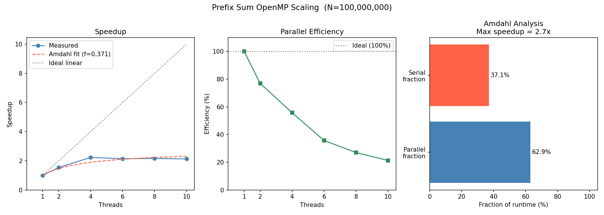

# Parallel Prefix Sum (Inclusive Scan)

## What is a prefix sum?

Given an input array `A[0..N-1]`, the **inclusive prefix sum** (scan) produces an output array `B` where:

```
B[0] = A[0]
B[1] = A[0] + A[1]
B[2] = A[0] + A[1] + A[2]
  ...
B[i] = A[0] + A[1] + ... + A[i]
```

Prefix sums appear everywhere: cumulative histograms, stream compaction, radix sort, polynomial evaluation, and load balancing in parallel algorithms.

## Why the naive parallel approach fails

The straightforward serial loop has a **carried dependency** — each output element depends on the previous:

```c
out[i] = out[i-1] + in[i];   // can't parallelize directly
```

Splitting this across threads and running `#pragma omp parallel for` produces a **race condition**: thread 1 may read `out[chunk-1]` before thread 0 has written it.

## Implementation strategy: block parallelism

This implementation uses **block (contiguous chunk) parallelism** rather than the default OpenMP striped schedule. Each thread owns a single contiguous slice of the array:

```
Thread 0: [0 .. N/T-1]
Thread 1: [N/T .. 2N/T-1]
Thread 2: [2N/T .. 3N/T-1]
  ...
```

Block ownership is **required** here — each thread must be able to prefix-sum its own chunk independently in Pass 1 before offsets are known. Interleaved assignment (the default `#pragma omp parallel for` schedule) would not work because adjacent elements would be owned by different threads, making it impossible to compute a local running sum.

Block layout also has a cache locality benefit: each thread's working set is a contiguous region of memory, which loads efficiently into L2/L3 cache with no false sharing on the output array.

## The three-pass parallel algorithm

The solution breaks the computation into three phases:

### Pass 1 — Local prefix sum (parallel)

Each thread independently prefix-sums its own contiguous chunk. This is fully parallel with no inter-thread communication.

```
Thread 0: [a0  a0+a1  a0+a1+a2  ...]    total0 = sum of chunk 0
Thread 1: [b0  b0+b1  b0+b1+b2  ...]    total1 = sum of chunk 1
Thread 2: [c0  c0+c1  c0+c1+c2  ...]    total2 = sum of chunk 2
```

### Pass 2 — Prefix sum of chunk totals (serial)

Compute the prefix sum of the `T` per-thread totals (where T is the number of threads — tiny compared to N):

```
offset[0] = 0
offset[1] = total0
offset[2] = total0 + total1
...
```

This runs serially over T elements, so it is negligible.

### Pass 3 — Add offsets (parallel)

Each thread (except thread 0) adds its offset to every element in its chunk:

```c
for (int i = start; i < end; i++)
    out[i] += offset[tid];
```

Again fully parallel and independent across threads.

### Diagram

```
Input:   [ a b c | d e f | g h i ]
                  T0      T1      T2

Pass 1 (parallel):
         [a a+b a+b+c | d d+e d+e+f | g g+h g+h+i]
          totals: [a+b+c, d+e+f, g+h+i]

Pass 2 (serial, 3 ops):
          offsets: [0, a+b+c, a+b+c+d+e+f]

Pass 3 (parallel):
         [a a+b a+b+c | a+b+c+d a+b+c+d+e ... | ...]
                           ^ added offset[1]
```

## Performance results

Platform: Apple M-series, 10 threads/workers, N = 100,000,000 doubles (800 MB).  
Memory bandwidth ceiling: ~130 GB/s (measured via dot product).

| implementation        | time (s) | GB/s | speedup |
|-----------------------|----------|------|---------|
| serial                | 0.051    | 31   | 1.0x    |
| OpenMP two-pass       | 0.024    | 67   | 2.2x    |
| Cilk `cilk_for`       | 0.040    | 40   | 1.3x    |
| Cilk `cilk_for` + barrier | 0.042 | 38  | 1.2x    |

### Why OpenMP outperforms Cilk here

Both implementations use the same three-pass block algorithm.  The difference is the scheduler:

- **OpenMP** uses a persistent thread pool with static block assignment.  The same thread that writes `out[lo..hi)` in pass 1 reads it again in pass 3 — its cache lines are still warm.
- **Cilk `cilk_for`** uses work-stealing with recursive task splitting.  Between the two separate `cilk_for` calls a different worker may claim the same block, causing cold cache reads in pass 3.  The recursive splitting also adds fixed overhead (≈ log₂ N spawn/sync operations) that is not justified for a flat, uniform workload.

The Cilk barrier version combines passes 1 and 3 inside a single `cilk_for` body with an atomic software barrier, guaranteeing the same worker handles both passes for each block.  At N=100M this recovers some locality but is still slightly slower than OpenMP due to the atomic and spin overhead of the barrier.

### Why neither reaches the memory bandwidth ceiling

Prefix sum is a sequential-dependency computation: the effective work per byte is low (one addition per element), and the three-pass structure reads the output array twice.  At 10 threads the hardware memory bandwidth is shared, and the bottleneck shifts from compute to DRAM bandwidth.  The 2.2× OpenMP speedup vs 10 threads reflects this: we saturate the memory bus well before running out of CPU.

### Amdahl's law and observed scaling

The serial fraction `f` in Amdahl's law bounds the maximum achievable speedup:

```
S(p) = 1 / (f + (1 - f) / p)
```

Pass 2 (serial scan of T totals) is O(T) while passes 1 and 3 are O(N/T) each.  Because T << N the serial fraction is tiny, so Amdahl predicts near-linear scaling — but memory bandwidth saturates first.



## Floating-point note

The parallel version produces results that are **not bit-identical** to the serial version because floating-point addition is not associative. Reordering the additions (by chunk) changes the rounding at each step. Both results are correct to within floating-point precision; the relative error is typically < 1e-10.

## Building and running

```bash
make omp_prefix_sum
./omp_prefix_sum [N] [threads]      # defaults: N=100000000, threads=10

~/opencilk/bin/clang -fopencilk -O3 cilk_prefix_sum.c -o cilk_prefix_sum
./cilk_prefix_sum [N] [blocks]      # defaults: N=100000000, blocks=10

# Scaling chart
python3 prefixsum_chart.py
```
